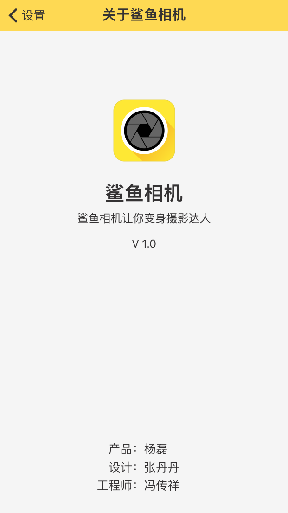

# FCXUniversial
里面现在集成在线参数、引导、好评、广告、发现、分享功能.

##使用Pod
使用时在Podfile里面写上：
```objc
pod 'FCXUniversial', :git => 'https://github.com/FCXPods/FCXUniversial.git'
```
注意：一定要先手动导入`FCXOnlineConfig+Implementation`（在UMOnlineConfig文件夹下）这个类到工程中，否则请求不到友盟参数（友盟在线参数不能集成在Pod里面，只能用一个不太好的方法解决）

##宏定义及常用Category
FCXDefine里面写了一些常用的宏定义，FCXCategory文件夹有常用的Category.


##在线参数
在线参数没有集成到Pod里面，需要手动下载并导入UMOnlineConfig整个文件夹（`FCXOnlineConfig+Implementation`这个类一定要导入，如果报错导入libz库）.

包含头文件
```objc
#import "FCXOnlineConfig.h"
```
* 1.调用一般参数.
```objc
+ (NSString *)fcxGetConfigParams:(NSString *)key;
+ (NSString *)fcxGetConfigParams:(NSString *)key defaultValue:(NSString*)defaultValue;
```

* 2.调用JSON格式参数.
```objc
+ (id)fcxGetJSONConfigParams:(NSString *)key;
```


##引导、好评功能
* 1.引导

引导功能包含在开屏广告里，不需要写.
* 2.好评

包含头文件
```objc
#import "FCXOnlineConfig.h"
```
```objc
调用函数[FCXRating startRating:APPID];（APPID是当前应用的AppID）.
```


##Admob广告
包含头文件:
```objc
#import "UIViewController+Advert.h"
```
调用函数:
```objc
- (void)showAdmobBanner:(CGRect)frame adUnitID:(NSString *)adUnitID;
- (void)showAdmobBanner:(CGRect)frame
               adUnitID:(NSString *)adUnitID
              superView:(UIView *)superView;
```


##开屏广告
导入AppDelegate+GS.h、AppDelegate+GS.m文件，然后在setupS函数修改里面两个地方：
* 1.修改时间（这个时间每次提交AppStore都要修改，时间修改为审核提交日往后退15天），这里的时间是为了用户第一次下载启动时获取不了友盟参数，这时默认不显示开屏广告，为了收益在获取不到参数时显示开屏.
```objc
showSplash = ([currentDateString compare:@"2016-04-26"] == NSOrderedDescending);

```
* 2.修改相应的appKey、placementId.
```objc
NSString *appKey = @"1105304662";
NSString *placementId = @"4050412012239592";
```

##发现
一定要先手动导入`FCXOnlineConfig+Implementation`这个类，否则请求不到友盟参数（友盟在线参数不能集成在Pod里面，只能用一个不太好的方法解决）

包含头文件
```objc
#import "FCXDiscoverViewController.h"
```
发现页面使用FCXDiscoverViewController这个类，这个页面需要显示admob的广告，为了和pod集成，增加了一个admobID属性，用来给默认的admobID，需要给它赋值.


##分享

###配置信息
配置plist文件里面URL schemes和白名单LSApplicationQueriesSchemes，具体可参考友盟.

在AppDelegate.m里包含头文件
```objc
#import "UMSocialData.h"
#import "UMSocialQQHandler.h"
#import "UMSocialSnsService.h"
#import "UMSocialWechatHandler.h"
#import "UMSocialSinaSSOHandler.h"
#import "FCXOnlineConfig.h"
#import "UMFeedback.h"
#import "MobClick.h"
#import "UMOnlineConfig.h"
```

调用配置函数，里面配置相应key的信息：
```objc
- (void)setupUmeng {
    NSString *appId = @"1097760130";//当前应用的appId
    NSString *umengKey = UMENG_KEY;
    NSString *wxAppId = @"wx26b92ca6b93bc970";
    NSString *wxAppSecret = @"71e33d4bf83c50d6cc75345fcaed37ea";
    NSString *sinaAppKey = @"4180739792";
    NSString *sinaAppSecret = @"8fb325b7ec68e9ad2aa1943d37aa947b";
    NSString *qqAppId = @"1105231107";
    NSString *qqAppKey = @"J7TYxjAmFbsIYIZK";

    //统计
    [MobClick startWithAppkey:umengKey reportPolicy:SEND_INTERVAL channelId:nil];
    [MobClick setAppVersion:XcodeAppVersion];

    //在线参数
    [UMOnlineConfig updateOnlineConfigWithAppkey:umengKey];

    //意见反馈
    [UMFeedback setAppkey:umengKey];

    //分享
    [UMSocialData setAppKey:umengKey];
    #ifdef DEBUG
    //打开调试log的开关
    [UMSocialData openLog:YES];
    #endif
    //设置微信AppId，设置分享url
    [UMSocialWechatHandler setWXAppId:wxAppId appSecret:wxAppSecret url:[NSString stringWithFormat:@"http://itunes.apple.com/cn/app/id%@?mt=8", appId]];

    //新浪
    [UMSocialSinaSSOHandler openNewSinaSSOWithRedirectURL:@"http://sns.whalecloud.com/sina2/callback"];
    [UMSocialSinaSSOHandler openNewSinaSSOWithAppKey:sinaAppKey secret:sinaAppSecret RedirectURL:@"http://sns.whalecloud.com/sina2/callback"];

    //设置分享到QQ空间的应用Id，和分享url 链接
    [UMSocialQQHandler setQQWithAppId:qqAppId appKey:qqAppKey url:[NSString stringWithFormat:@"http://itunes.apple.com/cn/app/id%@?mt=8", appId]];
    //qq分享音乐时，需要单独使用qq的分享
    TencentOAuth *qzone = [[TencentOAuth alloc] initWithAppId:qqAppId andDelegate:nil];
    qzone.redirectURI = @"www.qq.com";
    [UMSocialQQHandler setSupportWebView:YES];
}
```


###分享功能

目前支持通用的图文分享（邀请好友）、音乐分享、图片分享和单个平台分享.

包含头文件
```objc
#import "FCXShareManager.h"
```
####图文分享（邀请好友）
```objc
    FCXShareManager *shareManager = [FCXShareManager sharedManager];
    shareManager.presentedController = self;
    //标题、内容根据需要修改
    shareManager.shareTitle = @"成为财经高手，他们都用财经头条！";
    shareManager.shareContent = @"第一时间捕捉财经热点，从小白变身财经达人。";
    //连接默认是当前App的下载连接
    shareManager.shareURL = [NSString stringWithFormat:@"http://itunes.apple.com/cn/app/id%@?mt=8", APPID];
    NSDictionary *infoPlist = [[NSBundle mainBundle] infoDictionary];
    //图片默认显示当前App的Icon
    NSString *icon = [[infoPlist valueForKeyPath:@"CFBundleIcons.CFBundlePrimaryIcon.CFBundleIconFiles"] lastObject];
    shareManager.shareImage = [UIImage imageNamed:icon];

    [shareManager showInviteFriendsShareView];
```

####音乐分享
```objc
    FCXShareManager *shareManager = [FCXShareManager sharedManager];
    shareManager.presentedController = self;
    shareManager.shareTitle = @"音乐分享";
    shareManager.shareContent = @"最好听的铃声尽在【铃声大全】，快来下载使用吧！";
    //音乐连接
    shareManager.musicURL = @"http://music.huoxing.com/upload/20130330/1364651263157_1085.mp3";
    shareManager.shareImage = [UIImage imageNamed:@"share_qq"];
    shareManager.shareURL = [NSString stringWithFormat:@"http://itunes.apple.com/cn/app/id%@?mt=8", APPID];

    [shareManager showMusicShare];
```
####图片分享
```objc
    FCXShareManager *shareManager = [FCXShareManager sharedManager];
    shareManager.presentedController = self;
    shareManager.shareImage = [UIImage imageNamed:@"share_wx"];
    //QQ空间不支持只有图片的分享必须有内容
    shareManager.shareTitle = @"title";

    [shareManager showImageShare];
```
####单个平台分享
```objc
    FCXShareManager *shareManager = [FCXShareManager sharedManager];
    shareManager.presentedController = self;
    shareManager.shareImage = [UIImage imageNamed:@"share_wx"];
    //QQ空间不支持只有图片的分享必须有内容
    shareManager.shareTitle = @"title";
    //分享的样式图文（FCXShareTypeDefault）、图片（FCXShareTypeImage）、音乐（FCXShareTypeMusic）
    shareManager.shareType = FCXShareTypeImage;

    //分享的平台（可查看头文件）
    [shareManager shareToPlatform:FCXSharePlatformWXSession];
```


##关于
包含头文件:
```objc
#import "FCXAboutController.h"
```
设置数（详情可点击头文件查看注释）:
```objc
@property (nonatomic, copy) NSString *imageName;
@property (nonatomic, copy) NSString *appName;
@property (nonatomic, copy) NSString *midString;
@property (nonatomic, unsafe_unretained) BOOL showBottom;
@property (nonatomic, copy) NSString *bottomLeftString;
@property (nonatomic, copy) NSString *bottomRightString;

Example:
    FCXAboutController *about = [[FCXAboutController alloc] init];
    //标题可不写，默认是关于+CFBundleDisplayName
    about.title = @"关于鲨鱼相机";
    about.imageName = @"about_icon";
    about.showBottom = YES;
    about.midString = @"鲨鱼相机让你变身摄影达人";
    about.bottomRightString = @"杨磊\n张丹丹\n冯传祥";
    [self.navigationController pushViewController:about animated:YES];
```
界面样式：



